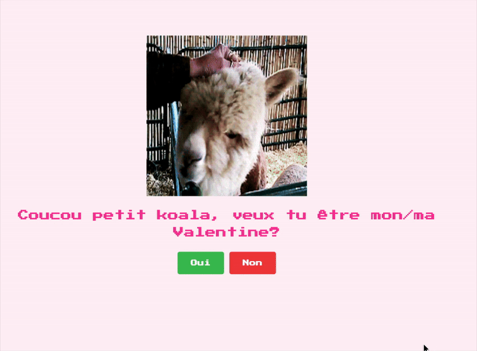

# My Valentine - Alpaga Edition

Une page interactive et amusante pour demander à quelqu'un d'être votre Valentine, avec des alpagas mignons et un bouton "Non" impossible à cliquer !

## Fonctionnalités

### Interactions
- GIF Alpaga animé au démarrage
- Bouton "Non" fuyant : Essayez de passer votre souris dessus... il s'échappe !
- Bouton "Oui" grandissant : Plus on refuse, plus il devient gros
- Changement d'images :
  - Alpaga triste quand on arrive à cliquer sur "Non"
  - Alpaga heureux quand on clique sur "Oui"

### Design
- Font Pixel Art style rétro (Press Start 2P)
- Couleurs douces rose et blanc
- Responsive et adapté à tous les écrans
- Message personnalisé : "Coucou petit koala, veux tu être mon/ma Valentine?"

## Démonstration

Visitez le projet sur GitHub : [https://github.com/dezzip/my-valentine](https://github.com/dezzip/my-valentine)



## Installation

### Utilisation locale

1. Clonez le repository
```bash
git clone https://github.com/dezzip/my-valentine.git
cd my-valentine
```

2. Ouvrez simplement le fichier
```bash
open index.html
```
Ou double-cliquez sur `index.html` dans votre navigateur

### Déploiement sur un serveur

#### Option 1 : Hébergement statique (Netlify, Vercel, GitHub Pages)
1. Uploadez tous les fichiers
2. Le site est prêt !

#### Option 2 : Serveur web classique
1. Uploadez les fichiers via FTP dans votre dossier web :
   - index.html
   - script.js
   - style.css
   - Dossier img/ (avec toutes les images)

## Structure du projet

```
my-valentine/
├── index.html          # Page principale
├── script.js           # Logique interactive
├── style.css           # Styles visuels
├── img/
│   ├── alpaga.gif      # Alpaga animé (page d'accueil)
│   ├── alpaga-sad.jpeg # Alpaga triste (clic sur "Non")
│   ├── aplaga happy.webp # Alpaga heureux (clic sur "Oui")
│   └── exemple.gif     # GIF de démonstration
└── README.md
```

## Comment ça marche ?

### Le bouton "Non" fuyant
```javascript
// Détecte le survol et déplace le bouton aléatoirement
noButton.addEventListener("mouseenter", moveNoButton);
noButton.addEventListener("mouseover", moveNoButton);
```

### Le bouton "Oui" grandissant
Chaque fois qu'on essaie de cliquer sur "Non", le bouton "Oui" devient 1.3x plus grand !

### Changement d'images
- Au démarrage : alpaga.gif (animé)
- Clic sur "Non" : alpaga-sad.jpeg (triste)
- Clic sur "Oui" : aplaga happy.webp (content)

## Personnalisation

### Changer le message
Dans `index.html`, ligne 18 :
```html
<p class="title">Coucou petit koala, veux tu être mon/ma Valentine?</p>
```

### Changer les images
Remplacez les fichiers dans le dossier `img/` en gardant les mêmes noms :
- `alpaga.gif` - Image/GIF d'ouverture
- `alpaga-sad.jpeg` - Réaction au "Non"
- `aplaga happy.webp` - Réaction au "Oui"

### Ajuster la vitesse du bouton
Dans `script.js`, modifiez la fonction `moveNoButton()` pour changer la zone de déplacement.

### Changer les couleurs
Dans `style.css` :
```css
body {
  background-color: #fff0f6; /* Couleur de fond */
}

.title {
  color: #f53699; /* Couleur du texte */
}
```

## Idées d'amélioration

- Partager sur les réseaux sociaux
- Ajouter des effets visuels au survol des boutons
- Ajouter un compteur de partages
- Créer des thèmes personnalisables
- Intégrer des musiques de fond
- Ajouter un mode sombre
- Créer une version mobile optimisée
- Ajouter des emojis animés
- Mémoriser les réponses en localStorage
- Ajouter un formulaire pour personnaliser le message

## Crédit

Créé par [Dezzip](https://github.com/dezzip)

## Licence

Ce projet est libre d'utilisation. Amusez-vous bien !

---

Projet sur GitHub : [https://github.com/dezzip/my-valentine](https://github.com/dezzip/my-valentine)
